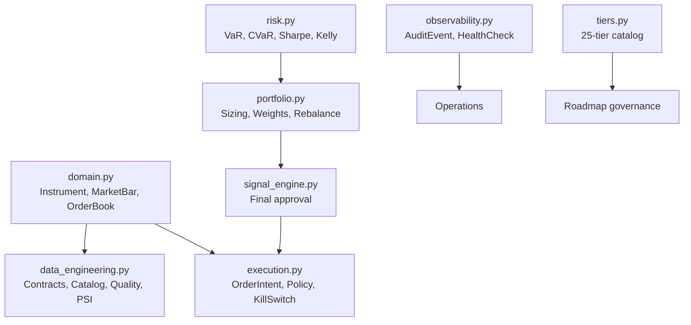

# Architecture Report

## Target architecture

```mermaid
flowchart LR
    Vendors[Market/Data Vendors] --> Adapters[Data Adapters]
    Adapters --> Contracts[Data Contracts]
    Contracts --> Quality[Data Quality + Drift]
    Quality --> Catalog[Metadata Catalog]
    Catalog --> FeatureStore[Feature Store]
    FeatureStore --> Research[Research OS + Alpha Lab]
    Research --> Models[ML/AI/LLM/Regime Models]
    Models --> Meta[Meta Decision Engine]
    Meta --> Signal[Final Signal Engine]
    Signal --> Risk[Risk Center]
    Risk --> Portfolio[Portfolio Construction]
    Portfolio --> Execution[Execution Engine]
    Execution --> Broker[Broker Adapter: Zerodha Kite]
    Execution --> TCA[Transaction Cost Analysis]
    Signal --> Audit[Audit Trail]
    Risk --> Audit
    Execution --> Audit
    Audit --> Observability[Monitoring + Health + Alerts]
```

## Implemented module map

## Integration boundaries

- All external payloads must be normalized into `Instrument`, `MarketBar`, or `OrderBookSnapshot` before downstream use.
- All datasets and feature views must declare a `DataContract` and be registered in `MetadataCatalog`.
- The final signal engine remains the only component allowed to emit executable BUY/SELL signals.
- Execution adapters must accept broker-neutral `OrderIntent` objects and enforce `ExecutionPolicy` and `KillSwitchState` before order placement.
- Operational events should be emitted as `AuditEvent` records and health probes as `HealthCheck` objects.
